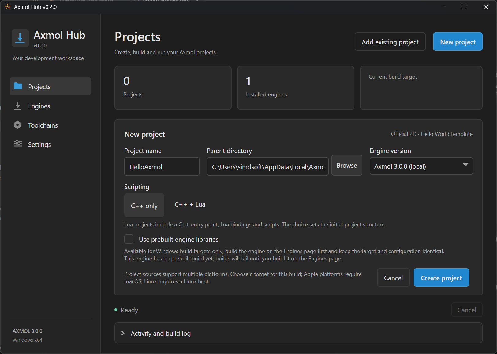
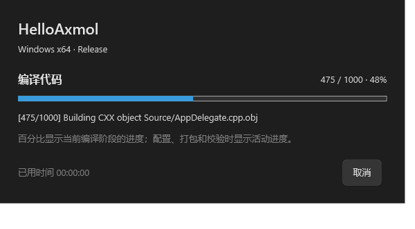
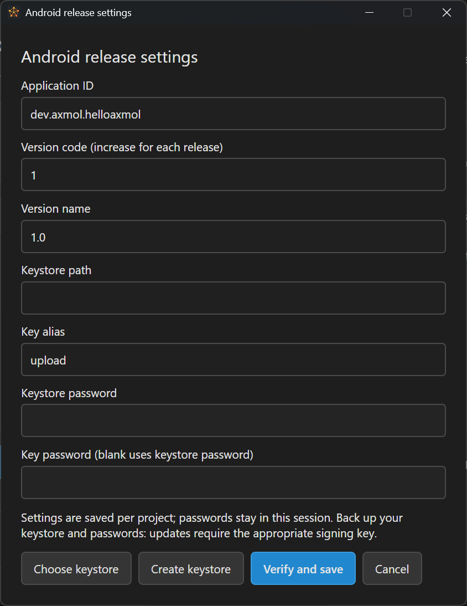

# Axmol Hub


**管理 Axmol 引擎、项目与构建工具链的独立桌面应用。**

当前版本 **v0.1.6**，处于早期开发阶段。图形界面使用 C# / .NET 8 / **Avalonia**（`net8.0`，目标三平台；Windows 上已实测可运行，macOS / Linux 尚未验收）。当前验证的引擎基线是 **Axmol 2.11.5**。


## 功能

- **引擎管理**：下载、导入、默认版本、修复与卸载；修复保留备份，卸载保留回收目录。
- **按版本添加模块**：选择引擎后勾选目标平台，自动合并公共工具依赖，显示组件状态和空间需求。
- **项目管理**：通过 Axmol 自带 CLI 创建仅 C++ 或 C++ + Lua 项目，锁定引擎版本和脚本方式；支持选择项目目录和编辑器。
- **构建与运行**：构建时选择平台、Debug / Release，输出分别保存；进度弹窗显示阶段、编译步骤、已用时间，可取消；成功后弹窗并打开产物目录。
- **工具链**：状态判定与引擎一致 —— 期望版本读引擎自带的 `1k/build.profiles`，
  查找顺序也按引擎的规则（`cmake`/`ninja`/`jdk`/`llvm`/`emsdk` **先看系统已装**，
  `axslcc`/`nuget` 引擎树优先，`sdkmanager` 只看引擎树），版本不符时提示「引擎会装它自己那一份」。
  安装交还引擎自己的 `setup.ps1`（工具落在引擎树内，**不是** Hub 数据目录）。
  （**已落地**：`axmol build/run/deploy` 承担构建、运行与部署 —— 见 docs/adr/0002）
- **日志**：构建与运行日志显示在应用中，同时保存到数据目录。
- **中文 / English**：设置中即时切换语言，选择数据目录、默认项目目录和 Visual Studio / VS Code。

创建项目时选择名称、目录、引擎和脚本方式，平台在构建时选择。更换数据目录会打开该目录自己的资料库，不自动迁移原文件。

## 平台状态

**游戏目标平台与 Hub 自身的运行平台是两回事。** Windows 图形版已实现；macOS / Linux 图形版尚未实现。

| 游戏目标 | 所需宿主 | 当前状态 |
| --- | --- | --- |
| Windows x64 | Windows | 托管 MSVC / SDK，Debug 与 Release 实际构建、Hello World 运行通过 |
| Android ARM64 / x64 | Windows、Linux、macOS | Windows 上 ARM64/x64 Debug 与 ARM64 Release APK/AAB 构建、签名和对齐通过；真机待验 |
| WebAssembly wasm32 | Windows、Linux、macOS | Windows 上真实构建与本地 HTTP 预览通过；浏览器 WebGL 场景待验 |
| Linux x64 | Linux | 构建与运行入口已接入，原生宿主待验 |
| macOS ARM64 / x64 | macOS | Xcode 构建入口已接入，原生宿主待验 |
| iOS / tvOS，设备与模拟器 | macOS | 构建计划与未签名入口已接入；签名、部署及设备运行待完成 |
| UWP / Xbox x64 | Windows | 目标管理与构建计划；隔离工具链和打包未完成，执行入口暂时阻止 |

CLI 已交叉发布 `win-x64`、`linux-x64`、`osx-x64`、`osx-arm64`；当前仅 Windows 宿主实际执行过。Android 支持 Debug / Release 签名 APK / AAB；Release 使用项目密钥，ARM64 发行包已实际构建和校验。

安装包未配置发布者代码签名，干净 Windows 10 / 11 的首次安装验收尚未完成。其他宿主和真实设备的支持状态不会由交叉发布或计划生成代替。

## 安装与首次使用

使用已发布的 Windows 安装包，选择可写安装目录。安装包自带 .NET 运行时，**使用者无需安装 .NET SDK**；引擎和开发工具按需下载，不随 Hub 安装包捆绑。如果尚无二进制附件，可以按“从源码运行”自行构建。

1. 在设置中选择数据目录、默认项目目录及语言。数据目录需要足够空间容纳引擎、工具和构建缓存。
2. 在“引擎”页安装 Axmol 2.11.5，选中版本，打开“添加模块”。
3. 勾选所需平台，保存并安装所选工具。当前自动下载清单针对 Windows 宿主。
4. 在“项目”页创建项目，选择“仅 C++”或“C++ + Lua”，再点击“构建”，选择平台和配置。
5. 构建成功后打开产物目录；点击“运行”启动游戏。Android 需连接设备并选择明确的设备序列号。

MSVC 使用微软官方安装器，会要求 Windows UAC，并登记新的系统级 Build Tools 实例及共享安装器组件。Hub 不修改全局 PATH、AX_ROOT 或 Git 配置，不自动选择已有 Visual Studio 实例进行修改；微软安装器的行为不属于便携安装。

Windows 程序发布到 `build-hub/run/<项目名>`；Release 为 `build-hub-release/run/<项目名>`。EXE、运行库、Content 与着色器保存为独立副本，资源校验失败不会覆盖旧运行产物。未修改的 Windows 模板入口将游戏日志接入 Hub；自定义项目入口保留自身日志行为。

## 创建项目



填写名称、父目录，选择已安装或导入的引擎，再选择脚本方式。当前使用官方 2D Hello World 模板：**仅 C++** 使用 cpp 模板；**C++ + Lua** 使用 lua 模板，同时生成 C++ 原生入口、Lua 绑定和 Content/src 脚本。Lua 支持属于同一引擎，不需要额外安装另一种引擎版本。

创建成功后自动收起表单并选中新项目，项目列表显示脚本方式。平台和 Debug / Release 在构建时选择。导入旧项目会从 .axproj 识别脚本方式，保存的类型与源项目冲突时会明确拒绝。

操作失败会弹窗告知，详细异常保留在日志中。创建目录已存在时，提示修改名称、选择其他目录或添加已有项目；现有目录不会被覆盖。

CLI 创建可省略平台：`AxmolHub.Cli.exe create <data-root> <name> <parent>` 默认 C++；最后加 `lua` 创建 Lua 项目。旧版显式目标参数仍兼容。

## 构建进度



配置和构建期间显示独立进度窗口。Ninja 编译步骤或 CMake 百分比来自实际工具输出，百分比只表示当前编译阶段；配置、Android 打包和校验阶段显示活动进度。窗口同时显示最新步骤和已用时间。

点击取消或关闭进度窗口会请求停止当前构建，等待子进程结束后关闭并恢复主窗口。失败时显示原因，成功时保留完成提示和打开产物目录。

## Android 发行签名



在项目页打开 **Android 发行设置**，或在构建窗口选择 Android 和 Release 后继续：

1. 设置正式应用包名（Application ID）、版本代码（versionCode）和版本名称（versionName）。每次商店更新递增 versionCode。
2. 选择已有 JKS / PKCS12 密钥库，或点击“新建密钥库”创建 RSA 2048 位 JKS，默认有效期 10000 天；已有文件不覆盖。
3. 输入密钥别名、密钥库密码及私钥密码。私钥密码留空时使用密钥库密码；点击“验证并保存”。
4. 构建 Release，得到签名的 `app-release.apk` 和 `app-release.aab`。发行输出与 Debug 隔离。

非密码配置保存在项目的 `.axmol-hub.android-release.json`，已由 Git 忽略。密码仅在当前会话使用，重启后重新输入；不会写入项目配置、Gradle 文件或命令参数。密钥库和密码需要单独备份，更新应用必须使用相应签名密钥。

Release 原生代码使用优化构建，APK 关闭 debuggable。Hub 核对 APK 包名/版本、APK/AAB 证书 SHA-256、资源、签名和 16KB 对齐后才记录成功；AAB 使用私有 JDK 规范化签名，检查 JAR 文件与流式读取兼容性。更换发行配置或密钥库后必须重新构建。

CLI 复用同一非密码配置，从 `HUB_ANDROID_STORE_PASSWORD`、`HUB_ANDROID_KEY_PASSWORD` 环境变量读取本次签名密码；不要把密码放进提交的脚本或命令参数。

Google Play 的 AAB 使用上传密钥，并需在 Play Console 配置 Play App Signing；自行分发可使用签名 APK。当前已用一次性测试密钥实际构建并校验 ARM64 Release；真机运行与商店提交尚未验收。参考 [Android 官方签名说明](https://developer.android.com/studio/publish/app-signing)。

## 从源码运行

### 界面

界面在 `src/AxmolHub.App/`（`net8.0`，目标三平台）。准备 .NET 8 SDK 或兼容 SDK，然后在本仓库根目录执行：

```powershell
dotnet build src/AxmolHub.App/AxmolHub.App.csproj -c Release
dotnet run --project src/AxmolHub.App -- --data-root ./data
```

**四个页面（项目 / 引擎 / 工具链 / 设置）与四个对话框窗口**：左侧 218px 导航、三行内容区（页面 / 状态栏 / 日志面板）、统计卡、表格、设备条、操作按钮行的位置与文案都与原 WPF 版对齐；与原版只有三处刻意差异，原因写在 [docs/avalonia-migration-plan.md](docs/avalonia-migration-plan.md) §5.7。业务逻辑全在 `AxmolHub.Core`（界面项目只负责装配），编排在 `Services/HubWorkspace.cs`。

**切换数据根已可用**：只重建工作区并丢弃页面缓存，**窗口本身不动** —— 因此它不依赖外壳形态。新根落盘失败时会在旧状态上就地报错，不会留下"界面指向新根、设置文件还写着旧根"的错位。

默认数据根是每用户的 `%LocalAppData%\AxmolHub\data`，设置保存在 `%LocalAppData%\AxmolHub\hub-settings.json` —— 不能放在程序目录旁边，因为 Velopack 更新时整体替换安装目录、卸载时删除整个安装目录。可以指定独立配置：

```powershell
dotnet run --project src/AxmolHub.App -- --data-root ./data --preferences ./artifacts/dev-preferences.json
```

`--data-root` 优先于保存的设置；`--preferences` 可用于隔离开发或检查配置。不要将设置、数据目录或下载的工具链提交到 Git。

### 命令行

```powershell
dotnet run --project src/AxmolHub.Cli -- <动词> [参数]
```

只构建 Hub 时用本机 .NET SDK；它**不会**被当作游戏构建工具链。游戏所需工具通过 Hub 的模块窗口安装。

### 运行期验收开关

界面项目自带几个开关。它们读的是**运行期真实对象**，不是"看代码对不对" —— 原因见
[docs/avalonia-migration-plan.md](docs/avalonia-migration-plan.md) §3.1：Avalonia 的样式与模板写错**不会报错**，只会静默退化。

```powershell
# 外壳、本地化与数据根切换的自检（68 条断言）
dotnet run --project src/AxmolHub.App -- --verify-shell ./tmp/shell-check.txt
# 主题层（37 条）/ 基础件（25 条）
dotnet run --project src/AxmolHub.App -- --verify-theme ./tmp/theme.txt
dotnet run --project src/AxmolHub.App -- --verify-foundation ./tmp/foundation.txt
# 无头截图：主窗口一张
dotnet run --project src/AxmolHub.App -- --smoke ./tmp/smoke.png
# 无头截图：四个页面 × 中英两种语言，共 8 张（README 里的页面图由此生成）
dotnet run --project src/AxmolHub.App -- --smoke-pages ./tmp/pages
# 真操作验收：在真实引擎源码树上跑引擎管理链路（后面跟若干个引擎目录）
dotnet run --project src/AxmolHub.App -- --verify-ops ./tmp/ops-check.txt <引擎目录> [更多引擎目录...]
```

`--verify-ops` 与另外三个的分工：它们验**界面**（跑在夹具上），它验**操作**（用真实引擎树）。
它只跑**不下载、不编译**的那部分 —— 工具链探测、引擎导入/校验/设为默认/移除、状态落盘重载、
无效输入拒绝；装引擎、装工具链、构建、运行、Android 打包会拉 GB 级数据或依赖完整工具链，
因此**显式记为跳过**并附原因（报告里的 `SKIP`）。不传引擎目录时依赖引擎的那组会自动降级为跳过，
所以在一台没有引擎的机器上它也能正常退出而不是失败。

> 临时产物统一写仓库的 `tmp/`（`cache/` 留给缓存类产物），两者都已在 `.gitignore` 里。
> 自检自己生成的夹具与截图也落在那里 —— 见 `Services/ScratchDirectory.cs`。

具体各读什么：`--verify-shell` / `--verify-theme` / `--verify-foundation` 读可视化树与渲染帧，
`--verify-ops` 读**操作真的执行之后**的状态与磁盘内容。`--verify-shell` 还会扫描 `**/*.axaml` 里的每个
`{DynamicResource X}`，确认它真的能解析 —— 少一个 key 同样不报错，只显示空白。

两个截图开关各带一道**防假绿**的判据，因为"进程退出 0"是躺着也能过的：`--smoke` 要求那帧不是纯色
（`SmokeCapture.FrameStats.IsBlank`）；`--smoke-pages` 在那之上再数一遍**不同内容**的张数 ——
八张全出来但只有 2 张不同，说明导航静默失效；只剩 4 张，说明切语言静默失效。两种都能让"非空白"全绿。
另外它会真切语言并落盘，所以结束时**切回原语言**；跑之前把 `--preferences` 指向临时文件即可不碰你的真实设置。

界面文案是**单一定义**的：中英两份都在 `AxmolHub.Core/HubTexts.cs`（190 条），界面项目只留一层"把文案灌进 Avalonia 资源字典"的薄适配。设置页因此同时是本地化管线的**活体验收台** —— 切换语言要就地重灌资源字典并让**已经存在的控件**换文字，这件事读代码判断不了，只能实跑（见上面的 `--verify-shell`）。

`--verify-shell` 有三条值得单独说的断言：

- **真切一次语言再切回来**，然后去读**早于切换就已建好**的控件上的文字（外壳导航项、设置页说明、引擎页表头）。它同时证明"已存在的控件跟着换文字"和"切回中文也生效"，并把设置文件落在临时目录里 —— 自检**不会**碰到你 `%LocalAppData%\AxmolHub\` 下的真实设置。去掉 `HubStrings.Apply` 那一行，构建照样 0 error，自检报 6 条 FAIL、退出 1。
- **切换一次数据根再切回来**：换根、落盘、旧页面被丢弃、引擎列表跟着变空、拒绝盘符根、重复切换是无操作。漏掉"丢弃旧页面"的后果是"界面看着正常，一点按钮就在读一个已经不属于当前会话的工作区"——去掉 `_pages.Clear()` 一行，构建照样 0 error，自检报 3 条 FAIL、退出 1。
- **逐页真实渲染**并逐个核对帧非空白（PNG 落在 `tmp/shell-render/`）。断言看得懂"有没有内容"，看不懂"有没有压在一起"；逐页截图补上了这一点 —— 本轮就是靠肉眼核对截图发现"显示 A 页、左侧高亮 B 页"，随后补了对应断言。

## CLI

```powershell
dotnet run --project src/AxmolHub.Cli -- help
dotnet run --project src/AxmolHub.Cli -- targets
dotnet run --project src/AxmolHub.Cli -- plan ./data ./data/projects/MyGame Release
dotnet run --project src/AxmolHub.Cli -- build ./data ./data/projects/MyGame Release
dotnet run --project src/AxmolHub.Cli -- run ./data ./data/projects/MyGame
```

构建示例要求资料库、引擎、项目与托管工具已经准备好。省略配置时使用项目保存的配置，旧项目默认 Debug。macOS / Linux 必须在对应宿主准备私有工具。

`--json` 是全局标志，可放在任意位置；加上它之后 **stdout 里恰好只有一份 JSON 信封**（退出码与不加时一致，日志与错误详情仍走 stderr），供脚本、CI、MCP Server 与 Axmol Editor 消费：

```powershell
dotnet run --project src/AxmolHub.Cli -- targets --json
dotnet run --project src/AxmolHub.Cli -- --json verify ./data windows-x64
```

契约、各动词的 `data` 形状与两个刻意保留的例外见 [docs/cli-json-contract.md](docs/cli-json-contract.md)。

## 检查与打包

行为检查运行于 Windows，使用真实 Axmol CLI 创建临时项目。将 **Axmol 2.11.5 完整源码**放在仓库旁边的 `../axmol-2.11.5`，或将第二个参数替换为自己的引擎目录：

```powershell
dotnet run --project tests/AxmolHub.Checks -c Release -- ./artifacts/checks ../axmol-2.11.5
```

每次复验使用新的输出目录，避免已有测试工具影响“组件缺失”检查。行为检查现共 **139 条断言**：主流程 **105 条**（覆盖进程参数、取消、下载校验、路径边界、metadata、配置隔离、资源发布及 Android 打包/设备参数等）+ CLI `--json` 契约 **34 条**；不替代真实设备或干净宿主验收。

其中 CLI 契约那 34 条**不依赖引擎与工具链**，因此已接进 CI（[docs/ci.md](docs/ci.md) §2.6），可单独跑：

```powershell
dotnet run --project tests/AxmolHub.Checks -c Release -- ./artifacts/checks --check-cli-json src/AxmolHub.Cli/bin/Release/net8.0/AxmolHub.Cli.dll
```

> 注：此前 README 写"112 项"，与 `docs/hub-development-plan.md` §3 与 `docs/ci.md` §3 的 105 对不上，是不同时间点用不同数法留下的。现已统一为上面的分解。

发布自包含图形版（RID 换成 `osx-arm64` / `osx-x64` / `linux-x64` 即可交叉发布，但只有 Windows 那一条实测过）：

```powershell
dotnet publish src/AxmolHub.App/AxmolHub.App.csproj -c Release -r win-x64 --self-contained true -o artifacts/app
```

构建 Windows 安装包并进行隔离安装检查：

```powershell
dotnet run --project tests/AxmolHub.Checks -- artifacts/packaging-tools --prepare-packaging
./installer/Build.ps1
./installer/Test.ps1 -Isolated
```

安装包由 [Velopack](https://velopack.io) 生成，输出到 `artifacts/releases/win-x64/`：`Axmol.Hub-win-Setup.exe`、免安装的 `-Portable.zip`、自更新载荷 `.nupkg` 与更新索引。安装器是一键式的，等级为当前用户，无需管理员。安装检查会临时打包并登记自己的程序身份与快捷方式，验证安装、自包含启动、中文目录、跨版本升级保留数据及卸载保留数据，结束后卸载测试实例、保留现有 Hub。打包工具说明见 [installer/README.md](installer/README.md)。

发布其他宿主的自包含 CLI：

```powershell
./installer/Build-Hosts.ps1
```

## 仓库结构

```text
src/
  AxmolHub.App/  桌面界面（net8.0，目标三平台）与图标
  AxmolHub.Core/          引擎、工具链、下载、状态、构建与部署
    Scripts/              运行时 PowerShell 包装，由各客户端复制到自己的输出目录
  AxmolHub.Cli/           宿主 CLI 入口
tests/
  AxmolHub.Checks/    无外部测试框架的行为检查程序
manifests/           固定工具版本、下载地址与 SHA-256
installer/           Velopack 打包、图标转换和安装检查脚本
licenses/            第三方许可文本
docs/images/         README 界面截图
```

引擎源码、SDK、编译器、个人项目、缓存、开发记录及 Git 历史不在这个源码目录中。`artifacts/`、`data/`、`bin/`、`obj/` 和个人设置由 `.gitignore` 排除。二进制附件适合放到 GitHub Releases，不要将整个运行资料库提交到源码仓库。

## 问题反馈与贡献

欢迎报告问题或提交改进。请提供 Hub / 引擎版本、操作系统、目标平台、Debug / Release、复现步骤及相关日志；发布日志前移除私人目录、设备序列号与凭据。

修改保持范围明确：界面逻辑在 `AxmolHub.App`，构建与状态逻辑在 Core，CLI 复用 Core。运行时 PowerShell 脚本归 `Core/Scripts/`（`Invoke-Axmol.ps1` 转发 `axmol` 子命令、`Invoke-AxmolSetup.ps1` 转发 `setup.ps1` —— 它们是 Core 级资产），由各客户端以内容文件复制到自己的输出目录，不放进任何单个客户端项目——否则删除或替换该项目会连带断掉其他项目的引用。新增界面文案同时提供中文和 English；进程调用使用参数列表。**工具链版本不在 Hub 里**：真源是引擎自带的 `1k/build.profiles`，安装由引擎的 `setup.ps1` 完成（见 docs/adr/0002）。**第三方 NuGet 包只能进 `AxmolHub.App`**（目前 `Velopack` + `Avalonia.*`），Core、Cli、Checks 必须保持**零 NuGet 依赖**，其离线冷构建是刻意保留的性质。说明实际运行的检查，以及尚未验证的宿主或设备。

## 许可证

Axmol Hub 自有代码采用 [MIT License](LICENSE)。第三方文件、引擎、SDK、编译器与运行时保留各自许可，详见 [第三方声明](THIRD_PARTY_NOTICES.md)。HUB 图标由生成式图像工具制作，源 PNG 与多尺寸 ICO 均保留在 `src/AxmolHub.App/Assets/`。
