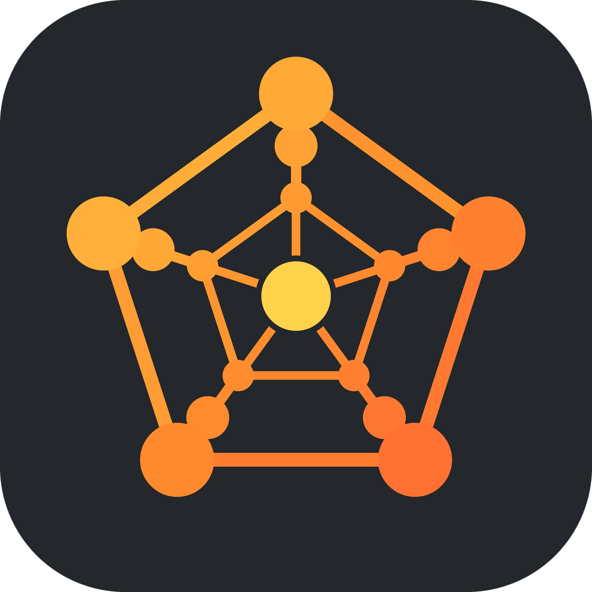
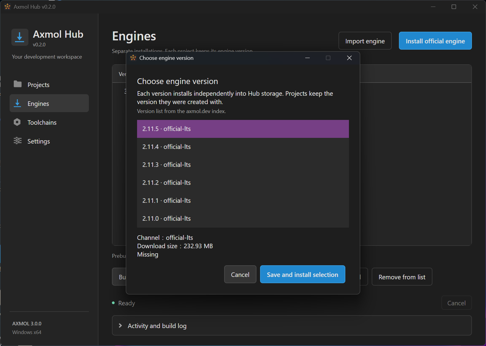

# Axmol Hub



**The Axmol workbench: engines, projects, and build toolchains managed for you — with a general-purpose coding agent built in, one that reads your code, edits it, and runs the build until it passes.**

The assistant is a general programming and debugging tool first. Axmol awareness — the engine index, the project digest, a toolchain pinned to the engine's own `1k/build.profiles`, and a shell the agent can drive and verify itself — is what makes it correct about this stack, not a limit on what it will answer.

[](https://www.orcarouter.ai/ref/ref_e3b6a1445aa97ab3c359)

Early stage — see [Releases](https://github.com/axmolengine/axmol-hub/releases) for what is shipping. The GUI is C# / .NET 8 / **Avalonia** (`net8.0`, targeting three platforms; validated on Windows, macOS / Linux not yet verified), and it is validated against the engine's current release line rather than one pinned build.



## What it does

- **Engine management** — download, import, set default, repair, and uninstall. Repair keeps a backup; uninstall keeps a recycle directory.
- **Project management** — create C++ or C++ + Lua projects through Axmol's own CLI, pinning engine version and script kind; choose the project directory and editor.
- **Build & run** — pick a platform and Debug / Release at build time, with outputs kept separate; a progress window shows phases, compile steps, and elapsed time, and can be cancelled.
- **Toolchain** — status detection mirrors the engine's own rules: expected versions come from the engine's `1k/build.profiles`, and the lookup order follows the engine (`cmake`/`ninja`/`jdk`/`llvm`/`emsdk` check the system first, `axslcc`/`nuget` prefer the engine tree, `sdkmanager` is engine-tree only). Installation is delegated to the engine's own `setup.ps1` (tools land inside the engine tree, **not** in Hub's data directory). Build, run, and deploy are delegated to `axmol build/run/deploy` — see [docs/adr/0002](docs/adr/0002-toolchain-and-build-delegated-to-engine-cmdline.md).
- **AI assistant** — Ask / Plan / Agent modes with explicit plan and tool approval. Inactive conversations can raise native notifications for approvals and run completion, failure, or timeout; unread approvals mark the Windows taskbar or macOS Dock icon. Linux notifications depend on an action-capable desktop notification service, and Linux app-icon badges are not available.
- **Logging** — build and run logs are shown in-app and saved to the data directory.
- **Chinese / English** — switch languages instantly in Settings, and choose the data directory, default project directory, and Visual Studio / VS Code.

Platform/architecture support is expressed by a single build-target model (`BuildTargets`), constrained by host OS and engine major version (v3 adds `windows-arm64`, `linux-arm64`, `wasm64`).

## Platform status

**Game target platforms and Hub's own runtime platform are different things.** The Windows GUI is implemented; macOS / Linux GUIs are not yet.

| Game target | Required host | Status |
| --- | --- | --- |
| Windows x64 | Windows | Managed MSVC / SDK; Debug and Release build and Hello World run verified |
| Android ARM64 / x64 | Windows, Linux, macOS | ARM64/x64 Debug and ARM64 Release APK/AAB build, signing, and alignment verified on Windows; on-device pending |
| WebAssembly wasm32 | Windows, Linux, macOS | Real build and local HTTP preview verified on Windows; browser WebGL scene pending |
| Linux x64 | Linux | Build and run entry points wired; native host pending |
| macOS ARM64 / x64 | macOS | Xcode build entry points wired; native host pending |
| iOS / tvOS, device and simulator | macOS | Build plan and unsigned entry points wired; signing, deploy, and on-device run pending |
| UWP / Xbox x64 | Windows | Target management and build plan; isolated toolchain and packaging not done, execution blocked |

The CLI cross-publishes `win-x64`, `linux-x64`, `osx-x64`, `osx-arm64`; only the Windows host has actually been exercised. Android supports Debug / Release signed APK / AAB; Release uses the project key, and the ARM64 release package has been actually built and verified. See [docs/android-release-signing.md](docs/android-release-signing.md) for the full signing workflow.

Installer packages are not yet code-signed, and first-install verification on a clean Windows 10 / 11 is not done yet.

## Quick start

Use a published Windows installer and pick a writable install directory. The installer bundles the .NET runtime — **no .NET SDK needed**; the engine and dev tools are downloaded on demand, not bundled with the Hub.

1. In Settings, choose the data directory, default project directory, and language. The data directory needs enough space for engines, tools, and build caches.
2. On the **Engines** page, install the engine version you want to target. On the **Toolchains** page, select that engine version and run `setup.ps1` to prepare the toolchain.
3. On the **Projects** page, create a project ("C++" or "C++ + Lua"), then click **Build** and pick a platform and configuration.
4. Open the output directory after a successful build; click **Run** to launch. Android needs a connected device with an explicit serial.

MSVC uses the Microsoft official installer, which requests UAC and registers a new system-level Build Tools instance. Hub itself does not modify global environment variables or Git config. When you explicitly run engine setup, Hub passes `-hub`: `AX_ROOT` and `PATH` are changed only in the setup process, not persisted to the user environment or shell profiles. On Windows, setup may still change the current user's PowerShell execution policy and request elevation. Hub does not auto-select an existing Visual Studio instance to modify.

## Building from source

The detailed guide — running the GUI from source, the runtime verification flags (`--verify-shell`, `--verify-theme`, `--verify-foundation`, `--smoke`, `--smoke-pages`, `--verify-ops`, plus the two headless ones `--check-secrets` and `--check-linux-integration`), the CLI contract, and packaging — lives in [docs/building-from-source.md](docs/building-from-source.md).

**You need a .NET SDK, and it needs a recent enough compiler.** The projects target `net8.0`, but the Avalonia 12.1.3 analyzers/source-generators are compiled against compiler version 4.14 — an older SDK 8 patch (e.g. the 8.0.1xx that `apt install dotnet-sdk-8.0` gives you on Ubuntu) only carries compiler 4.8, which silently fails to run the source generator and the build errors out with `CS0103: The name 'InitializeComponent' does not exist`. **.NET 10 SDK always works** (it ships a far newer compiler), so it's the safest choice on a dev machine. The SDK version you install and the `net8.0` target in the build output are two different things — that's why a successful build still prints `AxmolHub -> .../net8.0/AxmolHub.dll`. See [docs/ci.md](docs/ci.md) §2.4 for how CI pins its own SDK (8.0.x) and why that differs from the dev-machine recommendation.

Per-OS installation steps for the required **.NET 10 SDK** live in [docs/building-from-source.md](docs/building-from-source.md#安装-net-10-sdk) (macOS and Ubuntu; Windows via `winget install Microsoft.DotNet.SDK.10`).

Quick start:

```powershell
dotnet build src/AxmolHub/AxmolHub.csproj -c Release
dotnet run --project src/AxmolHub -- --data-root ./data
```

The CLI exposes a `--json` contract for scripts, CI, MCP, and the Axmol Editor; see [docs/cli-json-contract.md](docs/cli-json-contract.md).

## Repository layout

```text
src/
  AxmolHub/   Desktop GUI (net8.0, three platforms) and icon
  AxmolHub.Core/  Engine, toolchain, download, state, build, and deploy logic
    Scripts/      Runtime PowerShell wrappers, copied into each client's output
  AxmolHub.Cli/   Host CLI entry point
tests/
  AxmolHub.Checks/  Behavior checks with no external test framework
manifests/        Fixed tool versions, download URLs, and SHA-256
installer/        Velopack packaging, icon conversion, and install-check scripts
licenses/         Third-party license texts
docs/             Design decisions (ADR) and user-facing guides (Chinese)
docs/images/      README screenshots
```

Engine sources, SDKs, compilers, personal projects, caches, dev notes, and Git history live outside this source tree. `artifacts/`, `data/`, `bin/`, `obj/`, and personal settings are excluded by `.gitignore`. Binary attachments belong in GitHub Releases.

## Reporting issues and contributing

Welcome. Please include the Hub / engine version, OS, target platform, Debug / Release, reproduction steps, and relevant logs; redact private directories, device serials, and credentials before posting.

Keep changes scoped: UI logic in `AxmolHub`, build and state logic in `Core`, and the CLI reuses `Core`. Runtime PowerShell scripts belong to `Core/Scripts/` and are copied into each client's output, not into any single client project. New UI strings must provide both Chinese and English. **Toolchain versions do not live in Hub** — the source of truth is the engine's `1k/build.profiles`, and installation is the engine's `setup.ps1` (see [docs/adr/0002](docs/adr/0002-toolchain-and-build-delegated-to-engine-cmdline.md)). **Third-party NuGet packages may only go into `AxmolHub`** (currently `Velopack` + `Avalonia.*`); `Core`, `Cli`, and `Checks` must keep **zero NuGet dependencies** — their offline cold build is a deliberate property.

## Privacy policy

Axmol Hub does not collect telemetry or personal information. It accesses the network only to fetch engine and toolchain version information and to download engines, toolchains, and dependencies that you choose to install or update (from axmol.dev, GitHub, and configured mirrors). Log files written for troubleshooting stay on your machine.

## Code signing policy

Installer packages are currently unsigned. Until code signing is arranged separately, Windows installers trigger a SmartScreen warning and macOS packages need `xattr -r -d com.apple.quarantine` (or Apple notarization) before opening.

- Committers and reviewers: [@halx99](https://github.com/halx99)
- Approvers: [@halx99](https://github.com/halx99)

Privacy: see [Privacy policy](#privacy-policy).

## License

Axmol Hub's own code is [MIT](LICENSE). Third-party files, engines, SDKs, compilers, and runtimes keep their own licenses — see [THIRD_PARTY_NOTICES.md](THIRD_PARTY_NOTICES.md). The HUB icon was produced with a generative image tool; source PNG and multi-size ICO are kept in `src/AxmolHub/Assets/`.
